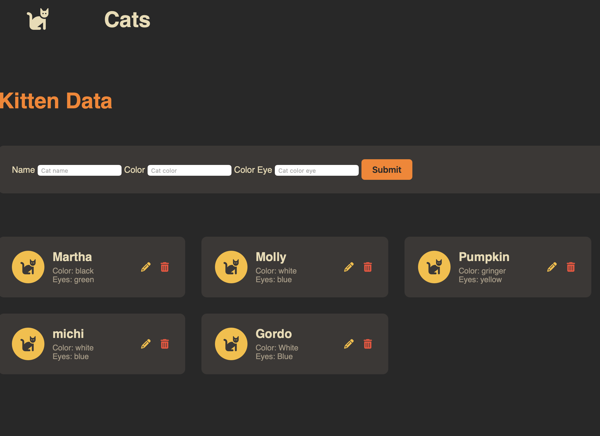

# Kitten-Flask

Kitten-Flask es un mini CRUD desarrollado en Flask con un enfoque en Clean Architecture, seguridad y buenas prácticas.
El objetivo de este proyecto es mostrar cómo construir APIs robustas, mantenibles y escalables con Python, separando responsabilidades entre capas y evitando problemas comunes como inyección SQL, mal manejo de conexiones o acoplamiento fuerte.

---

## Descripción

Este proyecto sirve como ejemplo práctico de cómo diseñar un backend con Flask aplicando principios sólidos de arquitectura:

- Arquitectura en capas (routes → services → repositories → database)
- Validación estricta con Pydantic
- Manejo seguro de conexiones por petición (thread-safe)
- Consultas SQL parametrizadas (sin inyección)
- Manejo centralizado de errores y excepciones

---

## Tecnologías utilizadas

| Tecnología                  | Uso principal                                |
|-----------------------------|-----------------------------------------------|
| Python                      | Lenguaje base del proyecto                   |
| Flask                       | Framework web ligero                         |
| MySQL / mysql-connector-python | Base de datos relacional y conexión     |
| Pydantic                     | Validación de datos de entrada / salida      |
| python-dotenv               | Manejo de variables de entorno               |




---

## Arquitectura del Proyecto

```
src/
 ├── database/
 │    └── connection.py          # Lógica de conexión a BD 
 ├── models/
 │    └── cat_models.py          # Modelos Pydantic 
 ├── repositories/
 │    └── cat_repo.py            # Consultas SQL 
 ├── services/
 │    └── cat_service.py         # Lógica de negocio 
 ├── routes/
 │    └── cat_routes.py          # Endpoints HTTP y validación
 ├── app.py                      # Configuración e inicialización de Flask
 └── .env.example                # Variables de entorno 
```

### Principios aplicados

- Separación de responsabilidades: cada capa tiene un propósito claro.
- Inyección de dependencias: los servicios no crean sus repositorios.
- Thread safety: conexiones controladas por contexto de petición.
- Validación estricta con Pydantic.
- SQL seguro: sin concatenar strings.
- Errores centralizados: respuestas limpias y consistentes.

---

## Decisiones de diseño

### Elección de Flask
Opté por Flask en lugar de frameworks más “estructurados” como Django o FastAPI porque:
- Permite control granular sobre la arquitectura y los componentes.
- Ideal para proyectos donde se quiere definir la arquitectura desde cero sin restricciones.
- Su ecosistema es maduro y estable, con gran documentación.
- Es perfecto para mostrar principios de arquitectura limpia sin depender del framework.

### Arquitectura en capas
En lugar de manejar toda la lógica en las rutas (un error común), separamos en:
- Rutas: solo reciben y responden requests, validan datos.
- Servicios: contienen la lógica de negocio pura, sin conocimiento del framework.
- Repositorios: encapsulan el acceso a datos.
- Base de datos: conexión y control de transacciones aislado.

Esto permite:
- Alta mantenibilidad.
- Bajo acoplamiento.
- Testing más sencillo (por capas).
- Posibilidad de cambiar la base de datos sin afectar la lógica de negocio.

### Validación con Pydantic
Aunque Flask no tiene validación nativa, se integró Pydantic porque:
- Permite definir modelos tipados claros para requests y responses.
- Simplifica la detección de errores de entrada.
- Aumenta la robustez del backend y la autogeneración futura de documentación.

### Manejo de conexión por petición
En lugar de usar una conexión global, se abre y cierra una conexión por cada request usando `flask.g` y `@app.teardown_appcontext`.
Esto:
- Evita condiciones de carrera y fugas de conexión.
- Mejora la escalabilidad.
- Permite hacer rollback automático si hay errores.

### Transacciones automáticas
La lógica de commit/rollback no vive en el servicio ni en el repositorio, sino en el teardown de la aplicación.
Esto centraliza el control de transacciones y mantiene las capas limpias.

---

## Instalación y configuración

```bash
# 1. Clonar el repositorio
git clone https://github.com/ErnestoAlns/Kitten-flask.git
cd Kitten-flask

# 2. Crear entorno virtual
python3 -m venv venv
source venv/bin/activate  # (Windows: venv\Scripts\activate)

# 3. Instalar dependencias
pip install -r requirements.txt
```

### Ejecutar el servidor
Crea una base de dstos en mysql
```sql
CREATE TABLE cats (
    id INT PRIMARY KEY AUTO_INCREMENT,
    name VARCHAR(50) NOT NULL,
    color VARCHAR(50) NOT NULL,
    color_eye  VARCHAR(50) NOT NULL
);
```

### Variables de entorno

Crea un archivo `.env`  con:

```
DB_HOST=localhost
DB_USER=root
DB_PASSWORD=yourpassword
DB_NAME=kittens
DB_PORT=3306
```

### Ejecutar el servidor

```bash
export FLASK_APP=app.py   
flask run
```

La API quedará disponible en `http://localhost:5000`.

---

## Endpoints de ejemplo

| Método | Endpoint      | Descripción                 |
|--------|---------------|-----------------------------|
| POST   | `/cats`       | Crea un nuevo gato          |
| GET    | `/cats/<id>`  | Obtiene un gato por ID      |
| GET    | `/cats`       | Lista todos los gatos       |
| PUT    | `/cats/<id>`  | Actualiza un gato   |
| DELETE | `/cats/<id>`  | Elimina un gato             |


---

## Contribución

Las contribuciones son bienvenidas.

1. Haz un fork del proyecto.
2. Crea una nueva rama (`feature/nueva-funcionalidad`).
3. Haz tus cambios con buenas prácticas.
4. Haz un Pull Request.

## Autor

Ernesto Alns
[GitHub](https://github.com/ErnestoAlns)

Proyecto desarrollado como ejemplo de arquitectura limpia y buenas prácticas en APIs Flask.
